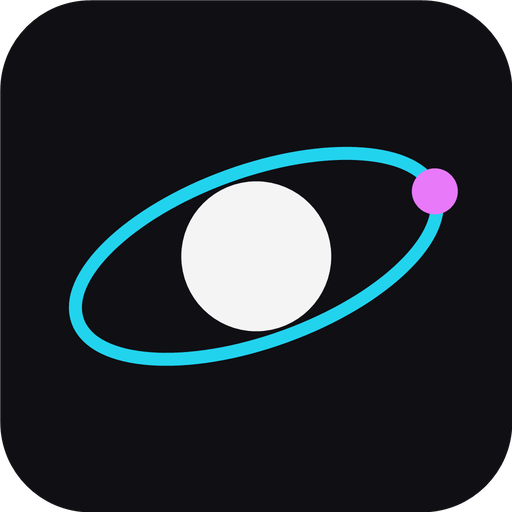
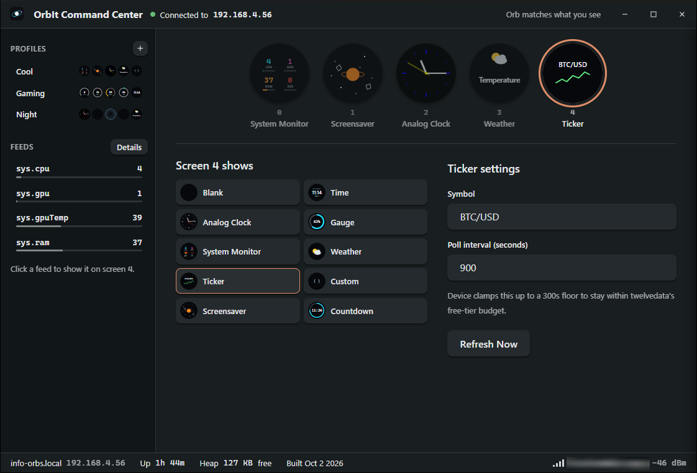

<div align="center">
  

  <h1>OrbIt Command Center</h1>

  <p>Five round screens on an <a href="https://github.com/brettdottech/info-orbs">info-orbs</a> device,<br><strong>one desktop app to assign, live-edit, and save layouts for all of them</strong><br>— clock faces, weather, a stock ticker, countdowns, or your own live system stats.</p>

  <p>
    
    
    
    
    
    
  </p>
</div>

A Tauri desktop app (Rust backend, React/TypeScript frontend) that drives the
[`orbit-api`](docs/orbit-api.md) REST surface exposed by the `OrbItWidget`
firmware — a visual designer for the device's 5 screens, local named
profiles you can flip between, and a tray-resident background service that
pushes live CPU/GPU/RAM stats to a screen automatically.

<p align="center">
  
</p>

> **Note:** `OrbItWidget` is a custom firmware fork, not (yet) part of
> upstream [info-orbs](https://github.com/brettdottech/info-orbs). It isn't
> currently in a state to submit as a PR upstream, so for now this app only
> works against that fork rather than stock info-orbs firmware.

> **Status:** actively developed, works against real hardware, not yet
> feature-complete — see [Roadmap](#roadmap).

## Run it

Requires [Node.js](https://nodejs.org/) 18+ and a
[Rust toolchain](https://www.rust-lang.org/tools/install) (stable). Tauri's
own platform prerequisites apply — see the
[Tauri prerequisites guide](https://tauri.app/start/prerequisites/) if
`npm run tauri dev` fails to build (Windows needs the WebView2 runtime and
the MSVC build tools, Linux needs the WebKitGTK dev packages, etc).

```bash
npm install
npm run tauri dev
```

The connect screen scans your network over mDNS and lists every orb running
the OrbIt widget — click one to connect. Discovery needs firmware with the core
web service (it advertises `_http._tcp` with an `orbit` TXT record); Windows may
ask you to allow the app through the firewall the first time it scans. If your
orb doesn't show up, enter its IP or `info-orbs-XX.local` hostname manually.

To build an installable binary instead:

```bash
npm run tauri build
```

The installer lands in `src-tauri/target/release/bundle/`.

## How it works

The device has 5 physical round screens, each independently assigned a
**control** (`time`, `analogClock`, `gauge`, `sysMonitor`, `weather`,
`ticker`, `custom`, `screensaver`, `countdown`, or `blank`) with its own
`params`. The full contract is documented in [`docs/orbit-api.md`](docs/orbit-api.md); this app is one client of it.

| Piece | Purpose |
| ----- | ------- |
| Designer | 5 round tiles standing in for the device's screens — pick a control per screen, fill in its form, see a dirty indicator, and push everything with one **Apply Layout** |
| Profiles | Save the current 5-screen layout under a name, stored locally (`profiles.json` in the app's data dir), and re-apply it later in one click |
| Countdown | Action-driven (set/pause/resume/restart/stop) rather than a saved config, so it gets its own always-live panel instead of going through Apply Layout |
| sysMonitor loop | A background task (Rust, ~5s interval) reads local CPU/RAM via `sysinfo` and GPU stats via `nvidia-smi` (best-effort, NVIDIA-only) and pushes them to whichever screen is assigned `sysMonitor` — keeps running from the system tray even with the window closed |
| Feeds | Named live numbers a `gauge` can follow instead of a typed-in value: the CPU/RAM/GPU readings one by one (`sys.cpu`, ...), plus anything another app on this PC posts to `http://127.0.0.1:47800/feeds/{name}` — see [`docs/feeds-api.md`](docs/feeds-api.md). The app pushes each bound screen its feed's latest value, at most once a second |
| Reconnect handling | Any failed request that means the device dropped off the network (not just a rejected one) drops the app back to the connect screen instead of silently going stale |

All state the device itself needs to keep across reboots lives on the
device (`docs/orbit-api.md`'s own NVS persistence) — this app never assumes
it's the only client and always treats a fresh `GET /screens` as the source
of truth.

## Files

- `src-tauri/src/device/` — the `orbit-api` HTTP client (`client.rs`), wire
  types (`model.rs`), and error mapping (`error.rs`); unit-tested against
  the documented request/response shapes
- `src-tauri/src/sysmonitor/` — the background push loop (`task.rs`), CPU/RAM
  collection (`collector.rs`), and best-effort GPU stats (`gpu.rs`)
- `src-tauri/src/feeds/` — the feed table (`registry.rs`), the local ingest
  endpoint (`server.rs`), screen-to-feed bindings (`bindings.rs`), and the
  loop that pushes bound screens their values (`pusher.rs`)
- `src-tauri/src/persistence/` — local profile storage (`profiles.rs`),
  atomic JSON read/write (`store.rs`)
- `src-tauri/src/tray/` — tray icon, menu, and close-to-tray window behavior
- `src-tauri/src/commands.rs`, `state.rs` — the Tauri command surface and
  shared app state
- `src/components/designer/` — the 5-screen grid, per-screen editor, and
  control picker
- `src/components/control-forms/` — one form per control type, registered in
  `index.ts`
- `src/components/profiles/` — save/list/apply/delete UI for local profiles
- `src/stores/` — Zustand stores: `deviceStore` (connection state),
  `layoutDraftStore` (live vs. unsaved-draft per screen), `profilesStore`
- `src/components/feeds/` — the Feeds drawer
- `docs/orbit-api.md` — the REST API spec this app implements against
- `docs/feeds-api.md` — the local endpoint other apps push feeds to
- `examples/` — example feed publishers: `random-feed.ps1` (a number that
  drifts up and down; the one to copy from) and `fps-feed.ps1` (the
  foreground program's frame rate, via PresentMon)

## Roadmap

Not in v1, in roughly the order they'd get picked up:

- Multiple saved devices
- Scheduling/automation for switching profiles
- A visual drawing-primitive editor for the `custom` control (v1 edits its
  params as raw JSON)
- MCP hooks so an AI assistant can drive screen content directly

## License

[GNU AGPLv3](LICENSE) — matches the license
[info-orbs](https://github.com/brettdottech/info-orbs) itself uses.
